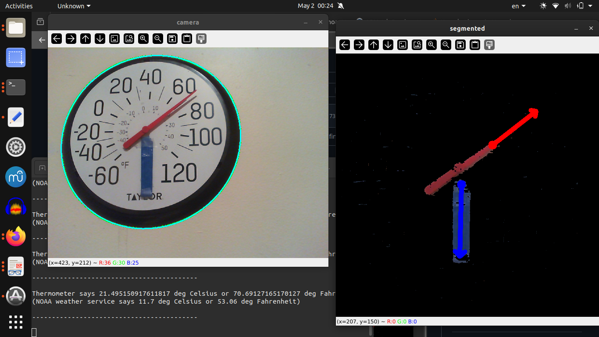
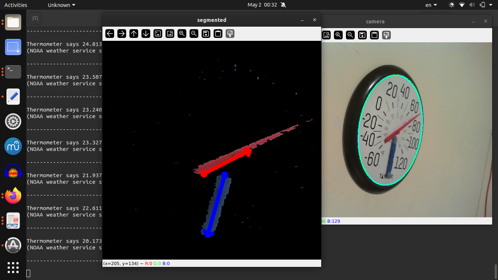

# Thermometer CV
2025 May 1-2

Lovely weather we're having.

This started with the question, "can I use computer vision to read a thermometer?"
The answer I found was yes.

First I segmented the white thermometer face as an ellipse, found points equally spaced in theta on its circumference, and used those points to transform the elliptical thermometer face to a circle. The image on the circle can still be skewed, but this has not presented much of a problem.

The image can also be tilted, which is a problem. Imagine the thermometer has shifted by 90 degrees (ie pi/2 radians, not degrees Fahrenheit!): then any reading will be wildly off. I tried Sobel filters and Hough transforms with the idea that if the thermometer were upright, there would be more vertical lines (than horizontal ones, or at least more vertical lines than if it were not upright). I abandoned this idea, though, finding it simplest to merely add a blue indicator to the thermometer to point downwards.

Segmenting the marker and the needle was not too hard, but finding the angle was a bit tricky because of how bounding boxes are labeled in opencv, as well as ambiguity of which direction a rectangle is pointing.

I found the angle thus... I got the short edges of the bounding boxes for the red needle and the blue marker (so if you see them not as blobs, but as line segments, then these would be their endpoints), then found the red short edge and blue short edge which are closest together: the midpoints of these red and blue short edges essentially mark the center of the thermometer.

I made vectors for the needle and marker pointing outwards from that intersection so that I could get an orientation. Then using cross product and dot product, I could find out which quadrant the needle was in, so I could use one or the other of the cross product and dot product to determine the angle.

Determining the temperature from the angle is simple.

Sometimes the vector for the thermometer needle points in the wrong direction. I considered that I could do some thresholding on the segmented needle or marker: e.g., they must be x pixels long to know that it's not an aberrant measurement.

However, a more entertaining idea occurred to me: check online for the current temperature. The incorrect readings were all wildly off, so it sufficed to create a 40-degree-celsius window centered on a temperature derived from the NOAA weather service, given my ZIP code; and discard any results outside this window.

Future work could include saving the thermometer and NOAA temperatures for data analysis.

I used noaa-sdk https://pypi.org/project/noaa-sdk/.

Other options I could look into (perhaps doing some averaging between their forecasted temperatures):
weather APIs:

1
https://pypi.org/project/accuweather/

2
https://pypi.org/project/weather-gov/0.1/
https://weather-gov.github.io/api/
https://github.com/spectrshiv/python-weather_gov

3
https://pypi.org/project/python-weather/