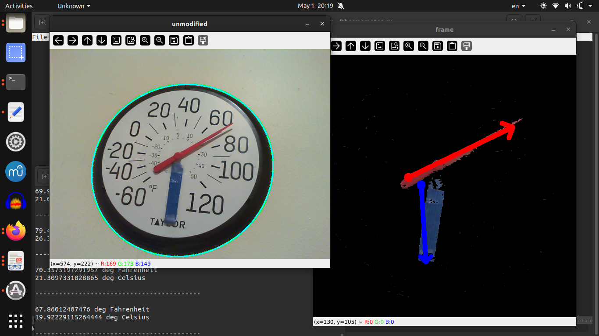

2025 May 1

I needed to make sure the thermometer was oriented correctly, otherwise the angle of the red needle has no frame of reference. I had the thought that I could use edge detection on the image of the thermometer itself, since the numbers on the face have a lot of vertical edges- I assumed that this could mean that the average edge was vertical, or that a map of just the vertical edges would be useful to determine the orientation of the thermometer.

I looked into Sobel and Hough functions. This didn't end up bearing much fruit.

Then I decided to put a blue marker on the thermometer, static, pointing downwards.

Segmenting the marker and the needle was not too hard, but finding the angle was a bit tricky because of how bounding boxes are labeled in opencv, as well as ambiguity of which direction a rectangle is pointing.

8:34 pm
I found the angle thus... I got the short edges of the bounding boxes for the red needle and the blue marker (so if you see them not as blobs, but as line segments, then these would be their endpoints), then found the red short edge and blue short edge which are closest together: the midpoints of these red and blue short edges essentially mark the center of the thermometer.

I made vectors for the needle and marker pointing outwards from that intersection so that I could get an orientation. Then using cross product and dot product, I could find out which quadrant the needle was in, so I could use one or the other of the cross product and dot product to determine the angle.

Determining the temperature from the angle is trivial.

A problem I have not resolved is that the segmentation sometimes finds the needle to point the exact opposite direction. Perhaps I could do some thresholding on the segmented needle and marker: e.g. the needle must be x pixels long to know that it's not an aberrant measurement. That looks like future work.

(A cheeky, therefore more entertaining, therefore more likely, solution is to use the weather forecast in READING the thermometer... the aberrant readings are almost always way off, so if the thermometer reads 74 Fahrenheit, and the aberrant readings say -41 or 132, we can check the forecast, which says 58, and conclude that readings far away from 58 (say, off from the forecast by 40 degrees F or more) should be discarded.)

Also future work, and more exciting, would be this: smoothing out the incorrect readings (perhaps by a moving average, but see the above parenthetical), then logging temperature in a file and comparing to weather forecasts in aggregate after the fact. In the winter, the temperature is greatly affected by the radiators, but now that we are approaching summer, the comparison should be more interesting.

weather APIs:

1
https://pypi.org/project/accuweather/

2
https://pypi.org/project/weather-gov/0.1/
https://weather-gov.github.io/api/
https://github.com/spectrshiv/python-weather_gov

3
https://pypi.org/project/python-weather/